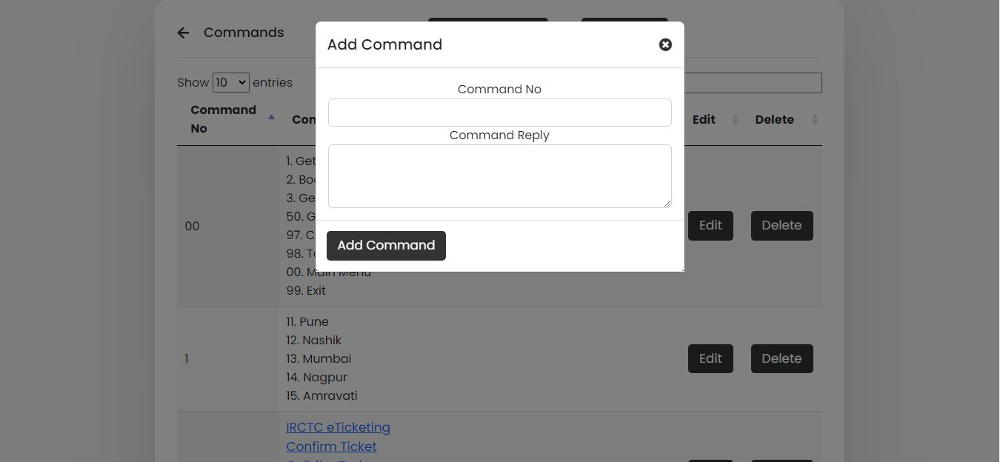

# Chat Support
It is Previous version of ChatApp But Automated Functionality Added.

Here we built a chatbot with some CSS styling, made front-end AJAX calls with JavaScript, handled queries with PHP script, and stored all messages in a MySQL database.

Users in both business-to-consumer (B2C) and business-to-business (B2B) environments increasingly use chatbot virtual assistants to handle simple tasks. Adding chatbot assistants reduces overhead costs, uses support staff time better and enables organizations to provide customer service during hours when live agents aren't available.

## How to Run This Project
Follow the steps below should be performed after you’ve started Apache and MySQL server in XAMPP.
- Extract the File.
- Copy the Main project folder Paste into C:\xampp\htdocs\
- Open a browser and go to URL http://localhost/phpmyadmin/
- Then, click on the databases tab
- Create a database naming "chatapp.sql" and then click on the import tab
- Click on browse file and select "chatapp.sql" file which is inside the folder
- Click on go.
- After Creating Database,
- Open a browser and go to URL http://localhost/Chat-Support/

Note : Don't Forgot to add mail credentials to php/resetmail.php, php/verifymail.php and php/resendmail.php

## Screenshots

## Developed By
- Swarup Kanade [@swarupkanade](https://www.github.com/swarupkanade)
- Omkar Kanade [@omkarkanade](https://www.github.com/omkarkanade)